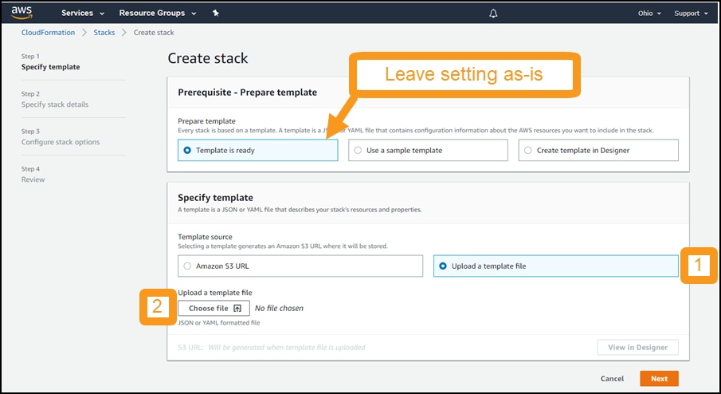
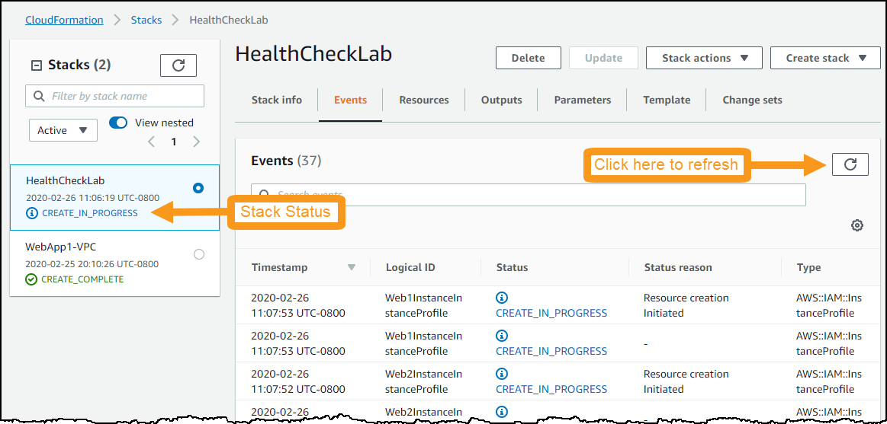

# Deploying an AWS CloudFormation stack to create web app infrastructure and service

1. Download the CloudFormation template. (You can right-click then choose **Save link as**; or you can right click and copy the link to use with `wget`)
    * WebApp: [_staticwebapp.yaml_](https://raw.githubusercontent.com/awslabs/aws-well-architected-labs/master/Reliability/300_Health_Checks_and_Dependencies/Code/CloudFormation/staticwebapp.yaml)

1. Go to the AWS CloudFormation console at <https://console.aws.amazon.com/cloudformation> and click **Create Stack** > **With new resources**

1. Leave **Prepare template** setting as-is
      * 1 - For **Template source** select **Upload a template file**
      * 2 - Click **Choose file** and supply the CloudFormation template you downloaded: `staticwebapp.yaml`
       

1. Click **Next**
1. For **Stack name** use **HealthCheckLab**
1. Leave all **Parameters** with their default values and click **Next**
1. Click **Next**
1. At the bottom of the page, select **I acknowledge that AWS CloudFormation might create IAM resources with custom names**
1. Click **Create stack**
     
1. This will take you to the CloudFormation stack status page, showing the stack creation in progress.  
    
  This will take approximately five minutes to deploy.  When it shows **status** _CREATE_COMPLETE_, then you are finished with this step.
